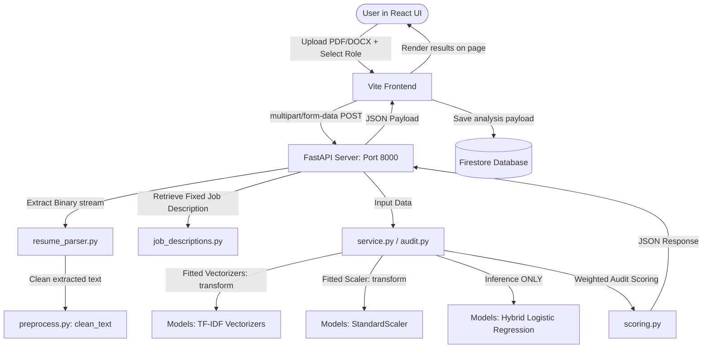

# Resume-to-Job-Description Fit Classifier (AI Placement Coach)

This directory contains the machine learning component for the **AI Placement Coach** academic project. It trains a supervised classifier to predict how well a candidate's resume matches a target job description.

---

## 1. Directory Structure

```text
backend/
└── ml/
    └── resume_analyzer/
        ├── dataset/
        │   ├── train_cleaned.csv                  # Cleaned training dataset
        │   └── test_cleaned.csv                   # Cleaned testing dataset
        ├── models/
        │   ├── resume_tfidf_vectorizer.pkl        # Fitted baseline Resume vectorizer
        │   ├── job_description_tfidf_vectorizer.pkl # Fitted baseline JD vectorizer
        │   ├── label_encoder.pkl                  # Label encoder
        │   ├── logistic_regression_model.pkl      # Baseline Logistic Regression
        │   ├── linear_svm_model.pkl               # Baseline Linear SVM
        │   ├── improved/                          # Stage 4 Deliverables
        │   │   ├── improved_resume_fit_model.pkl  # Selected improved model (Logistic Regression)
        │   │   ├── logistic_regression_model.pkl  # Improved Logistic Regression
        │   │   ├── random_forest_model.pkl        # Improved Random Forest
        │   │   ├── resume_tfidf_vectorizer.pkl    # Copied Resume vectorizer
        │   │   ├── jd_tfidf_vectorizer.pkl        # Copied JD vectorizer
        │   │   ├── label_encoder.pkl              # Copied Label encoder
        │   │   └── skill_vocabulary.json          # Predefined skill vocabulary
        │   └── hybrid/                            # Stage 5 Deliverables (Hybrid ML)
        │       ├── hybrid_logistic_regression_model.pkl # Selected Hybrid Model
        │       ├── hybrid_linear_svm_model.pkl    # Hybrid Linear SVM
        │       ├── resume_tfidf_vectorizer.pkl    # Copied Resume vectorizer
        │       ├── jd_tfidf_vectorizer.pkl        # Copied JD vectorizer
        │       ├── feature_scaler.pkl             # StandardScaler for matching features
        │       ├── label_encoder.pkl              # Copied Label encoder
        │       └── skill_vocabulary.json          # Predefined skill vocabulary
        ├── results/
        │   ├── stage3/                            # Baseline evaluation figures
        │   │   ├── logistic_regression_confusion_matrix.png
        │   │   └── linear_svm_confusion_matrix.png
        │   ├── stage4/                            # Improved evaluation figures
        │   │   ├── logistic_regression_confusion_matrix.png
        │   │   └── random_forest_confusion_matrix.png
        │   └── stage5/                            # Hybrid evaluation figures
        │       ├── logistic_regression_confusion_matrix.png
        │       └── linear_svm_confusion_matrix.png
        ├── src/
        │   ├── preprocess.py                      # Reusable text cleaning functions
        │   ├── prepare_data.py                    # Data cleaning & duplicates handler
        │   ├── train.py                           # Baseline training (Stage 3)
        │   ├── feature_engineering.py             # Similarity & skill feature extractor
        │   ├── train_improved.py                  # Improved training (Stage 4)
        │   ├── train_hybrid.py                    # Hybrid training (Stage 5)
        │   ├── predict.py                         # Baseline prediction (Stage 3)
        │   ├── predict_improved.py                # Improved prediction (Stage 4)
        │   ├── predict_hybrid.py                  # Hybrid prediction (Stage 5)
        │   ├── scoring.py                         # Stage 6: Resume Fit Score calculations
        │   └── audit.py                           # Stage 6: Complete Resume Audit orchestrator
        └── README.md                              # This documentation
```

---

## 2. Project Pipeline & ML Concepts

### A. Stage 3 Baseline Pipeline
*   **Approach:** Concat TF-IDF (Resume + Job Description).
*   **Representation:** High-dimensional sparse space (40,000 TF-IDF features) representing vocabulary tokens.
*   **Model:** Logistic Regression / Linear SVM.
*   **Selected:** Logistic Regression due to higher Macro F1.

### B. Stage 4 Experimental Model
*   **Approach:** Similarity & Skill Matching Feature Engineering.
*   **Representation:** Compact dense space (10 numerical features):
    1.  `resume_jd_cosine_similarity`: Cosine similarity of TF-IDF vectors of resume and JD.
    2.  `keyword_overlap_ratio`: Percentage of meaningful terms in the job description present in the resume (excluding standard stopwords).
    3.  `resume_word_count`: Word count of the resume.
    4.  `job_description_word_count`: Word count of the job description.
    5.  `resume_to_jd_length_ratio`: Ratio of resume length to job description length.
    6.  `resume_skills_count`: Number of technical skills found in the resume.
    7.  `jd_skills_count`: Number of technical skills found in the job description.
    8.  `matched_skills_count`: Number of overlapping skills between resume and job description.
    9.  `missing_skills_count`: Skills present in the job description but absent in the resume.
    10. `skill_match_ratio`: Ratio of matched skills to total job description skills.
*   **Fixed Domain Knowledge:** Predefined list of 37 technical skills (e.g. `Python`, `SQL`, `AWS`, `C++`, `Machine Learning`) mapped consistently using regex word boundaries to avoid partial matching (e.g. preventing 'c' from matching inside 'cat').

### C. Stage 5 Hybrid Model
*   **Approach:** Combined TF-IDF sparse lexical vectors with scaled 10 dense matching features.
*   **Feature Scaling:** The 10 dense features are normalized using `StandardScaler` (z-score scaling) fitted ONLY on training data. TF-IDF features are left in their original L2-normalized sparse representation. Both representations are stacked horizontally: `[Resume TF-IDF | JD TF-IDF | StandardScaler(Engineered Features)]` to form a sparse `40,010`-dimensional hybrid feature matrix.

### D. Stage 6 Resume Fit Scoring Layer (Application-Level)

Stage 6 is **not** a new ML model. It is a transparent, deterministic scoring layer built on top of the Stage 5 Hybrid ML predictions. Its purpose is to convert raw ML outputs into a user-friendly **Resume Fit Score** (0–100) for the website.

**Important academic distinction:**
*   The ML model's classification probabilities are **learned from the dataset** during training.
*   The Resume Fit Score weights, category thresholds, strength rules, and suggestion rules are **application-level design choices** defined by the project team. They are **NOT** learned from data.

---

## 3. How to Run

### Step 1: Preprocess and Prepare Data
```bash
python backend/ml/resume_analyzer/src/prepare_data.py
```

### Step 2: Train Baseline Models (Stage 3)
```bash
python backend/ml/resume_analyzer/src/train.py
```

### Step 3: Train Improved Models (Stage 4)
```bash
python backend/ml/resume_analyzer/src/train_improved.py
```

### Step 4: Train Hybrid Models (Stage 5)
```bash
python backend/ml/resume_analyzer/src/train_hybrid.py
```

### Step 5: Run Predictions
*   **Baseline Prediction:**
    ```bash
    python backend/ml/resume_analyzer/src/predict.py
    ```
*   **Improved Prediction:**
    ```bash
    python backend/ml/resume_analyzer/src/predict_improved.py
    ```
*   **Hybrid Prediction:**
    ```bash
    python backend/ml/resume_analyzer/src/predict_hybrid.py
    ```

### Step 6: Run Resume Fit Audit (Stage 6)
```bash
python backend/ml/resume_analyzer/src/audit.py
```

---

## 4. Model Performance Comparison (Actual Results)

### Cosine Similarity Bug Fix (Stage 6 Investigation)

During Stage 6 implementation, an investigation revealed that the cosine similarity feature was always returning `0.0000` in the prediction pipeline. The root cause was a **feature-space mismatch bug**: the resume and job description were being vectorized by *separate* TF-IDF vectorizers (`resume_vectorizer` and `jd_vectorizer`), each with their own independent vocabulary. Since the element-wise `multiply()` operation requires vectors to be in the *same* coordinate space, multiplying vectors from different vocabulary spaces produces zero dot products for all shared-meaning terms.

**Fix applied:** Both texts are now projected into the *same* TF-IDF feature space (the `resume_vectorizer`) specifically for the cosine similarity calculation. The separate `jd_vectorizer` is still used for the JD's own TF-IDF representation in the hybrid feature matrix, preserving the model architecture.

**Impact on model performance:** The fix improved the Stage 5 Hybrid Logistic Regression from **46.18%** to **46.78%** Macro F1, confirming that a meaningful cosine similarity signal helps the classifier.

### Final Experimental Compilation (Post-Fix)

| Stage | Feature Representation | Model | Accuracy | Macro F1 | Weighted F1 |
| :--- | :--- | :--- | :---: | :---: | :---: |
| Stage 3 | TF-IDF only | Logistic Regression | 48.44% | 44.25% | 48.06% |
| Stage 3 | TF-IDF only | Linear SVM | 48.95% | 43.26% | 47.77% |
| Stage 4 | 10 Engineered features | Logistic Regression | 39.80% | 39.33% | 40.35% |
| Stage 4 | 10 Engineered features | Random Forest | 40.36% | 36.53% | 40.38% |
| **Stage 5** | **Hybrid (TF-IDF + 10 Eng)** | **Logistic Regression** (Selected) | **50.03%** | **46.78%** | **50.16%** |
| Stage 5 | Hybrid (TF-IDF + 10 Eng) | Linear SVM | 50.48% | 45.78% | 49.84% |

*   **Selected Model:** **Stage 5 Hybrid Logistic Regression**
    *   **Rationale:** It achieved the highest **Macro F1 score** (`46.78%`) across all stages. Combining lexical TF-IDF features with structured matching signals (skills, ratios, corrected cosine similarity) produces the best generalization across all three classes.

---

## 5. Ablation Study Results (Post-Fix)

| Experiment | Features | Macro F1 |
| :--- | :--- | :---: |
| A (Baseline) | TF-IDF only | 44.25% |
| B | TF-IDF + Cosine Similarity only | 46.43% |
| C (Selected) | TF-IDF + All 10 Engineered Features | **46.78%** |

*Conclusion:* After the cosine similarity fix, even adding *only* Cosine Similarity now improves the baseline by **+2.18%** (previously it had degraded the baseline because the broken feature was pure noise). Adding all 10 engineered features provides the best result at **+2.53%** over the text-only baseline.

---

## 6. Engineered Feature Coefficients in Hybrid LR (Post-Fix)

| Feature | Good Fit | No Fit | Potential Fit |
| :--- | :---: | :---: | :---: |
| `resume_jd_cosine_similarity` | **+0.3470** | **-0.5266** | +0.1796 |
| `keyword_overlap_ratio` | +0.0504 | -0.2103 | +0.1599 |
| `resume_to_jd_length_ratio` | -0.1625 | +0.0087 | +0.1538 |
| `resume_word_count` | +0.1019 | +0.1216 | -0.2234 |
| `jd_skills_count` | +0.0951 | +0.0047 | -0.0999 |
| `matched_skills_count` | +0.0672 | +0.0134 | -0.0806 |
| `missing_skills_count` | +0.0831 | -0.0005 | -0.0826 |
| `job_description_word_count` | -0.1302 | +0.1338 | -0.0036 |
| `skill_match_ratio` | +0.0364 | -0.0749 | +0.0386 |
| `resume_skills_count` | -0.0133 | +0.0180 | -0.0047 |

**Key observation:** After the fix, `resume_jd_cosine_similarity` is now the **single strongest coefficient** for `Good Fit` (+0.3470) and the strongest negative coefficient for `No Fit` (-0.5266), confirming that lexical similarity between resume and JD is a powerful signal when measured correctly.

---

## 7. Data Leakage Prevention Audit
*   **Target Labels:** No testing labels were used at any stage during preprocessing, vectorizing, scaling, or model fitting.
*   **TF-IDF Vectorizers:** Fit solely on the training splits; test splits transformed only.
*   **StandardScaler:** Fit solely on the training engineered features; test splits transformed only.
*   **Status:** **PASSED**.

---

## 8. Stage 6: Resume Fit Scoring Layer

### 8.1 Purpose

The website needs a user-friendly score from 0–100. However, the ML model outputs a 3-class probability distribution (`Good Fit`, `Potential Fit`, `No Fit`), not a score. Stage 6 creates a transparent, deterministic conversion layer.

**This score is NOT:**
*   A probability of getting hired.
*   An actual ATS (Applicant Tracking System) score.
*   A recruiter acceptance probability.

**This score IS:**
*   An application-level estimate of how well a resume matches a target job description, derived from our trained ML model predictions and measurable text-matching features.

### 8.2 Scoring Formula

```
Resume Fit Score = (0.50 × ML Compatibility) + (0.30 × Skill Score) + (0.15 × Keyword Score) + (0.05 × Similarity Score)
```

**These weights are application-level design choices, NOT learned model parameters.**

If the Skill Score is unavailable (no recognized skills in the JD), its 30% weight is redistributed proportionally among the remaining components.

### 8.3 Component Definitions

#### ML Compatibility Score (0–100)
Converts the model's 3-class probabilities into a single continuous value:

```
ML Compatibility = 100 × P(Good Fit) + 60 × P(Potential Fit) + 20 × P(No Fit)
```

This preserves the model's full probability distribution rather than using only the argmax prediction.

#### Skill Score (0–100 or null)
```
Skill Score = skill_match_ratio × 100
```
Returns `null` if the JD contains zero recognized technical skills, with the message: *"No recognized skills were found in the job description."*

#### Keyword Score (0–100)
```
Keyword Score = keyword_overlap_ratio × 100
```
No artificial inflation is applied.

#### Similarity Score (0–100)
```
Similarity Score = cosine_similarity × 100
```
Cosine similarity is computed by projecting both resume and JD into the same TF-IDF space. Its weight is intentionally small (5%) because lexical similarity can be limited when resume and JD vocabulary differ stylistically.

### 8.4 Score Interpretation Ranges

| Score Range | Category | Description |
| :---: | :--- | :--- |
| 90–100 | Excellent Match | Very strong alignment across all dimensions |
| 75–89 | Strong Match | Good overall fit with minor gaps |
| 60–74 | Moderate Match | Reasonable fit with notable improvement areas |
| 40–59 | Needs Improvement | Significant gaps between resume and target role |
| 0–39 | Low Match | Very limited alignment with the target role |

**These thresholds are project-defined. They are NOT derived from recruiter research or the training dataset.**

### 8.5 Strengths Generation (Rule-Based)

| Condition | Strength Statement |
| :--- | :--- |
| `skill_match_ratio >= 0.75` (and JD has skills) | "Strong alignment with required technical skills." |
| `keyword_overlap_ratio >= 0.50` | "Good keyword alignment with the target job description." |
| `predicted_label == "Good Fit"` | "Your resume shows strong overall compatibility with this role." |

### 8.6 Suggestions Generation (Rule-Based)

| Condition | Suggestion |
| :--- | :--- |
| `skill_match_ratio < 0.50` (and JD has skills) | "Consider adding relevant skills from the job description that you genuinely possess." |
| `keyword_overlap_ratio < 0.30` | "Consider aligning relevant terminology in your resume with the target job description." |
| `missing_skills` is not empty | "Review the missing skills and highlight relevant experience on your resume if you possess it." |
| `resume_word_count < 300` | "Consider adding relevant project or experience details to flesh out your resume." |

**All suggestions encourage truthful resume improvement. No suggestion tells users to add skills they do not possess.**

### 8.7 Audit Output Structure

The `run_resume_audit()` function returns a dictionary with the following fields:

```python
{
    "resume_fit_score": 81,           # Final score (0-100, integer)
    "fit_category": "Strong Match",   # Project-defined category
    "predicted_label": "Good Fit",    # ML model's argmax prediction

    "ml_compatibility_score": 97.98,  # ML component (0-100)
    "skill_score": 90.0,             # Skill component (0-100 or null)
    "keyword_score": 21.43,          # Keyword component (0-100)
    "similarity_score": 37.88,       # Similarity component (0-100)

    "skill_match_ratio": 0.9000,     # Raw ratio
    "keyword_overlap_ratio": 0.2143, # Raw ratio
    "cosine_similarity": 0.3788,     # Raw similarity

    "good_fit_probability": 0.9495,       # ML class probability
    "potential_fit_probability": 0.0505,   # ML class probability
    "no_fit_probability": 0.0000,          # ML class probability

    "matched_skills": ["git", "python", ...],  # From feature engineering
    "missing_skills": ["machine learning"],     # From feature engineering

    "strengths": [...],     # Rule-based statements
    "suggestions": [...]    # Rule-based recommendations
}
```

### 8.8 Academic Transparency: What Is Learned vs. What Is Designed

| Aspect | Source | Category |
| :--- | :--- | :--- |
| Logistic Regression coefficients | Trained on 6,234 samples | **Learned by ML** |
| TF-IDF vocabulary & IDF weights | Fitted on training text | **Learned by ML** |
| 3-class probability predictions | Model inference | **Learned by ML** |
| StandardScaler mean/variance | Fitted on training features | **Learned by ML** |
| Score weights (50/30/15/5) | Project team decision | **Application-level rule** |
| Score category thresholds | Project team decision | **Application-level rule** |
| ML compatibility class values (100/60/20) | Project team decision | **Application-level rule** |
| Strength condition thresholds | Project team decision | **Application-level rule** |
| Suggestion condition thresholds | Project team decision | **Application-level rule** |
| 37-skill vocabulary list | Domain knowledge | **Application-level rule** |

---

## 9. Stage 7: Production Inference Architecture

### 9.1 Production Data Flow Diagram



### 9.2 Critical Academic Guarantee: No Training During Inference

*   **Offline Training Pipeline:** Vectorizers (`resume_tfidf_vectorizer.pkl`, `jd_tfidf_vectorizer.pkl`), StandardScaler (`feature_scaler.pkl`), and the classification model (`hybrid_logistic_regression_model.pkl`) were fit *only* on the training dataset.
*   **Online Production Inference Pipeline:** During the REST API request lifecycle to `/api/v1/resume/audit`, **absolutely zero fitting or training occurs**.
    *   No calls to `.fit()` or `.fit_transform()` are present in the server execution flow.
    *   Production data is cleaned and then projected into the existing feature space using `.transform()` *only*.
    *   All classification labels are predicted using the pre-loaded static models.
    *   Predefined job descriptions are parsed as static application inputs rather than training samples.

